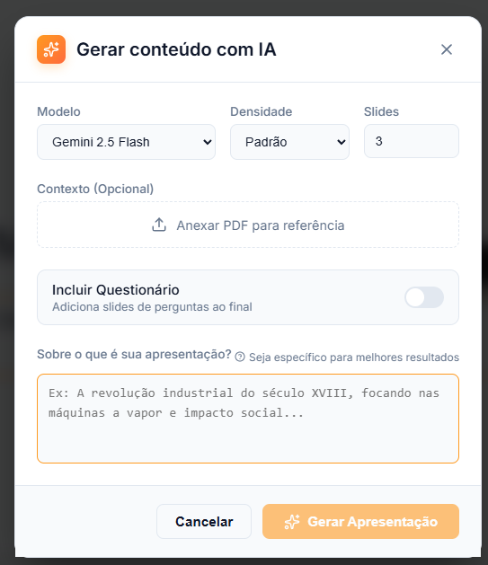
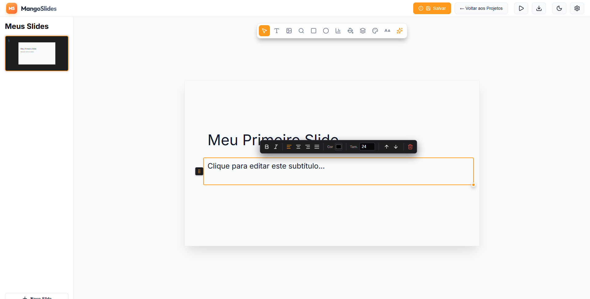

# Mango Slides 🥭

O **Mango Slides** é uma ferramenta moderna para criação de apresentações dinâmicas e inteligentes. Combinando a leveza de um aplicativo desktop com o poder da Inteligência Artificial, ele permite que você crie slides incríveis em segundos.

## ✨ Funcionalidades Principais

*   **🤖 Inteligência Artificial (Gemini):** Gere slides completos, melhore textos e crie tópicos automaticamente.
*   **📊 Gráficos Interativos:** Adicione e edite gráficos de Barras, Linhas e Pizza com facilidade.
*   **🖼️ Busca de Imagens:** Integração com Unsplash para encontrar fotos de alta qualidade sem sair do app.
*   **🎬 Modo Apresentação:** Player nativo com transições suaves, tela cheia e navegação fluida.
*   **🎨 Temas & Design:** Alterne entre temas (Dark, Light, Corporate, Criativo) e fontes com um clique.
*   **🔒 Seguro:** Suas chaves de API e dados ficam salvos apenas localmente no seu computador.

---

## 📸 Capturas de Tela

  
  

---

## 📥 Instalação

Este aplicativo foi projetado para ser usado diretamente, sem necessidade de configuração de ambiente de desenvolvimento.

**Não clone este repositório** se você deseja apenas usar o software. Siga os passos abaixo:

1.  Navegue até a aba **[Releases](../../releases)** deste repositório no GitHub.
2.  Encontre a versão mais recente (marcada como `Latest`).
3.  Na seção "Assets" (Arquivos), faça o download do instalador para o seu sistema:
    *   **Windows:** `MangoSlides_x.x.x_x64_en-US.msi` ou `setup.exe`
4.  Execute o arquivo baixado e instale o Mango Slides no seu computador.

---

## ⚙️ Configuração

Após instalar, você pode turbinar o Mango Slides configurando suas próprias chaves de API. O aplicativo funciona em modo "Demonstração" sem elas, mas as funcionalidades de IA e Busca Real dependem dessas chaves.

### 1. Configurar IA (Google Gemini)
Para usar o assistente de geração de texto e slides:
1.  Abra o Mango Slides e clique no ícone de **Engrenagem** (Configurações) no canto superior direito.
2.  Vá até a aba **Inteligência Artificial**.
3.  No campo **Gemini API Key**, cole sua chave.
    *   👉 *Você pode obter uma chave gratuita aqui: [Google AI Studio](https://aistudio.google.com/app/apikey)*

### 2. Configurar Busca de Imagens (Unsplash)
Para pesquisar fotos reais ao invés de usar imagens aleatórias:
1.  Nas mesmas **Configurações**, procure pelo campo **Unsplash Access Key**.
2.  Cole sua chave de acesso.
    *   👉 *Desenvolvedores podem criar uma chave aqui: [Unsplash Developers](https://unsplash.com/developers)*

> **Nota:** Todas as chaves são armazenadas localmente de forma criptografada no seu dispositivo.

---

### 🛠️ Desenvolvimento (Opcional)

Apenas se você for um desenvolvedor e quiser contribuir com o código:

1.  Clone o repositório.
2.  Instale as dependências: `npm install`
3.  Execute em modo dev: `npm run tauri dev`
